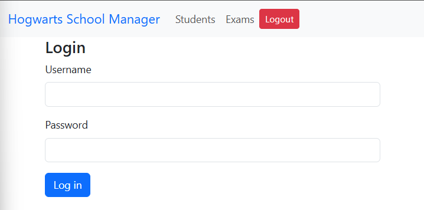
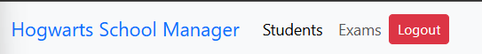
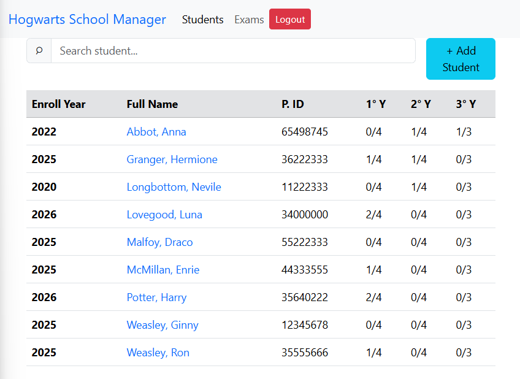
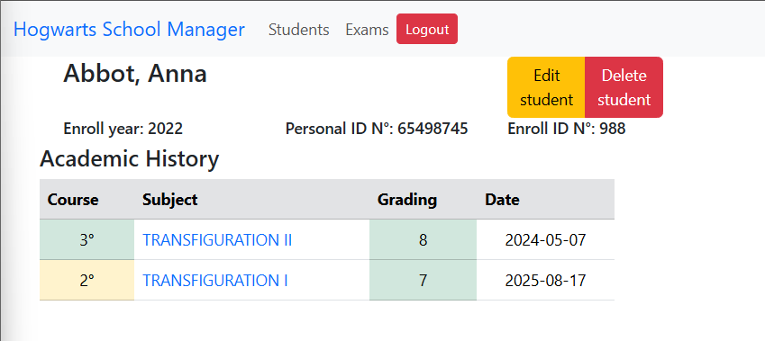
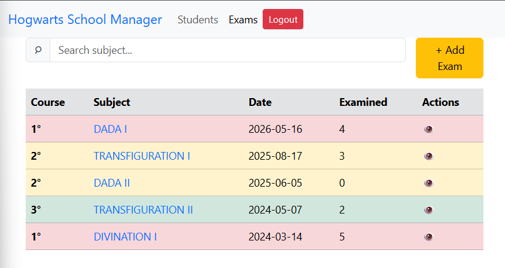
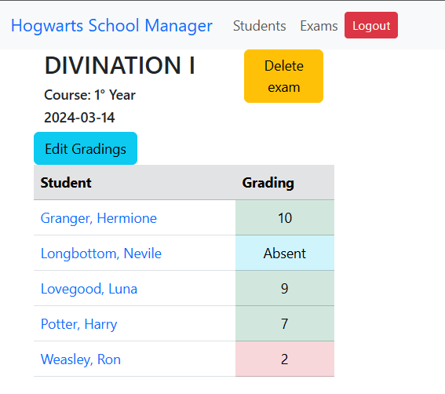
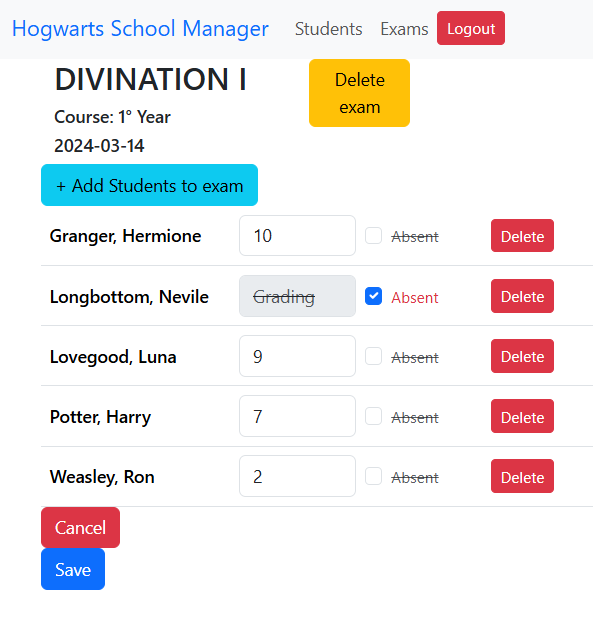
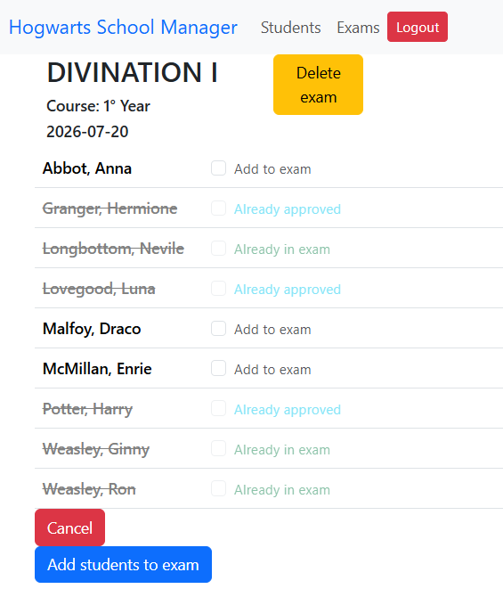

# School Management System (Capstone Project - CS50w)
This project is a full-stack, mobile-responsive web application for managing students, subjects, exams, and grades in a school context. It combines a Django backend with a React frontend to provide a simple and organized administrative workflow.

## Table of Contents
- [Features](#features)
- [Technologies Used](#technologies-used)
- [How to Run It](#how-to-run-it)
- [How to Use the Application](#how-to-use-the-application)
- [Distinctiveness and Complexity](#distinctiveness-and-complexity)
- [Project Structure and File Overview](#project-structure-and-file-overview)
- [Design Decisions](#design-decisions)
- [Coding Decisions](#coding-decisions)

## Features
- Manage student records
- Create and list exams
- Register grades and absences
- View each student's academic profile
- Authenticate users with a login system

## Technologies Used
- [Django](https://www.djangoproject.com/) *(backend for API routes and database)*
- [React](https://es.react.dev/) *(frontend)*
- [Bootstrap](https://getbootstrap.com/docs/5.3/getting-started/introduction/) *(CSS styles)*

## How to Run It
- The computer must have [Node.js](https://nodejs.org/es/download) installed.
- Clone this repository to your local machine.
- In the main folder, use `pip install -r requirements.txt` to install the Python dependencies.
- Navigate to the **frontend** folder and use `npm install` to install the React dependencies.
- Navigate to the **capstone** folder and run `python manage.py runserver` to start the backend server.
- Open another terminal, navigate to the **frontend** folder, and run `npm run dev` to start the React frontend server.
- Visit `http://localhost:5173/` (where `:5173` is the port used by the frontend server, by default).

## How to Use the Application
### Log in

  

When the user enters the front page of the application, they will be prompted to log in. The test user is:
- Username: **dumbledore**
- Password: **lemonpie**

This redirects the user to the *Students Page*.

### Navigation Bar

  

The user may use this bar to navigate to the *Students Page*, the *Exams Page*, or *Logout* from the application.

### Students Page

  

This page lists the students alphabetically. For each student, it shows the **Enroll Year**, the **Full Name**, the **Personal ID Number**, and the **Subjects Approved** in each of the three yearly courses of the career.

In this page, the user may:
- Use the **Search student** bar to locate a student by typing their first or last name.
- Click on the **+ Add Student** button to register a new student.
- Go to any current student's **profile page** by clicking on their name.

### Profile Page

  

This page shows the student's personal information and academic history.

In this page, the user may:
- Use the **Edit student** button to update the student's personal information.
- Use the **Delete student** button to delete the student (and all of its gradings).
- Click on any **Subject** to navigate to that particular exam.

### Exams Page

  

On this page, all exams are listed, ordered by date (from recent to past). For each exam, the page shows the **course**, the **subject**, the **date of the exam**, the **total number of students examined** in that exam, and a button to **see the exam**.

The exams are **color graded** to help the user identify the **course** of the subject examined at a glance (*red* for 1st course, *yellow* for 2nd course, and *green* for 3rd course).

In this page, the user may:
- Use the **Search subject** bar to locate all the exams of a particular subject.
- Use the **Add exam** button to register a new exam.
- Click on any **exam** to navigate to that exam's gradings.

### Grading Page

  

The Grading Page shows the gradings for each student in the exam. The gradings are **color graded** to identify at a glance the approved (*green*), disapproved (*red*), and absent (*blue*) students.

In this page, the user may:
- Use the **Delete exam** button to eliminate the exam (and its gradings).
- Use the **Edit Gradings** button to navigate to the *Edit Gradings* page for this exam.
- Click on any **student** to navigate to that student's profile page.

### Edit Gradings Page

  

This page allows the user to edit the gradings of an exam and add or delete students from it.
When a student is added, it is mandatory for the user to insert a grading or set it as absent before saving the changes to the exam.

In this page, the user may:
- Use the **+ Add Students to exam** button to add students to the current exam.
- Update each student's **grade** on the exam, or set it as **absent**.
- Delete students from the exam using the **Delete** button beside each student.
- **Save** or **Cancel** the changes made to the exam.

### Add Students to Exam Form

  

This form is accessed from the *Edit Gradings Page*. It shows the user a list of students that are available to add to the exam. All students are listed alphabetically, but those already in the exam are unavailable to select, as well as those students who have already approved the examined subject in a previous instance.

In this form, the user may:
- Mark one or more students to be added to the exam using a **checkbox**.
- Add the selected students to the exam using the **Add students to exam** button, or use the **Cancel** button to return to the *Edit Gradings Page* without making changes.

## Distinctiveness and Complexity
This project uses the technologies learned in the CS50W course to create a solution for teachers and school management staff, helping them keep track of students' academic history.

It provides users with an integrated view of current students' academic history and allows them to add students, add exams, and record grades. It also lets users enter each student's profile to get a quick view of that student's exam history.

It uses a Python Django backend that serves an API, and a JavaScript React frontend that consumes that API. It has a relational database model that links students and exams to subjects and grades. The API delivers ready-to-use JSON responses to the frontend, and the requests it receives are validated in the backend before any changes are made to the database.

The application uses several design patterns from previous projects in this course ([Commerce](https://github.com/Polomeo/commerce), [Mail](https://github.com/Polomeo/mail), [Network](https://github.com/Polomeo/network)) as a basis for creating a new solution for this school management scenario.

## Project Structure and File Overview
The following list describes the custom files created for this project. Base framework files such as Django project initialization and React/Vite entry files are intentionally omitted.

### Backend Files
- [capstone/api/models.py](capstone/api/models.py): Defines the database models for students, subjects, exams, and grades, including serialization methods used by the API.
- [capstone/api/views.py](capstone/api/views.py): Contains the API logic for authentication, student creation and editing, exam creation and deletion, grading updates, and profile information.
- [capstone/api/urls.py](capstone/api/urls.py): Maps the available API endpoints to the corresponding view functions.
- [capstone/capstone/settings.py](capstone/capstone/settings.py): Configures the Django project, including CORS settings that allow API requests from the frontend.
- [capstone/api/admin.py](capstone/api/admin.py): Registers the app models for Django admin access.
- [capstone/api/apps.py](capstone/api/apps.py): Declares the application configuration for the Django app.
- [capstone/api/tests.py](capstone/api/tests.py): Placeholder test file for future automated testing.

### Frontend Pages
- [frontend/src/pages/ExamsPage.jsx](frontend/src/pages/ExamsPage.jsx): Main page for viewing, searching, and creating exams.
- [frontend/src/pages/StudentsPage.jsx](frontend/src/pages/StudentsPage.jsx): Main page for viewing, searching, and adding students.
- [frontend/src/pages/GradingPage.jsx](frontend/src/pages/GradingPage.jsx): Page used to manage grades for a specific exam and add students to it.
- [frontend/src/pages/ProfilePage.jsx](frontend/src/pages/ProfilePage.jsx): Page that shows a student's personal information and academic history.
- [frontend/src/pages/LoginPage.jsx](frontend/src/pages/LoginPage.jsx): Login screen for authenticated users.

### Frontend Components
- [frontend/src/components/AddExamButton.jsx](frontend/src/components/AddExamButton.jsx): Button that opens the exam creation workflow.
- [frontend/src/components/AddExamForm.jsx](frontend/src/components/AddExamForm.jsx): Form used to create a new exam.
- [frontend/src/components/AddStudentButton.jsx](frontend/src/components/AddStudentButton.jsx): Button that opens the student creation workflow.
- [frontend/src/components/AddStudentForm.jsx](frontend/src/components/AddStudentForm.jsx): Form used to create a new student.
- [frontend/src/components/AuthLoggedInRoutes.jsx](frontend/src/components/AuthLoggedInRoutes.jsx): Protects private routes so only authenticated users can access them.
- [frontend/src/components/ButtonStateToggle.jsx](frontend/src/components/ButtonStateToggle.jsx): Reusable UI helper for toggling visual button states.
- [frontend/src/components/DeleteStudentForm.jsx](frontend/src/components/DeleteStudentForm.jsx): Form used to confirm and execute student deletion.
- [frontend/src/components/EditGradingsButton.jsx](frontend/src/components/EditGradingsButton.jsx): Button that enables grading editing mode.
- [frontend/src/components/EditStudentForm.jsx](frontend/src/components/EditStudentForm.jsx): Form used to edit an existing student's information.
- [frontend/src/components/ErrorsList.jsx](frontend/src/components/ErrorsList.jsx): Displays validation and request errors to the user.
- [frontend/src/components/ExamGradingAddStudentForm.jsx](frontend/src/components/ExamGradingAddStudentForm.jsx): Form used to add a student manually to an exam grading context.
- [frontend/src/components/ExamGradingAddStudentList.jsx](frontend/src/components/ExamGradingAddStudentList.jsx): Lists students that can be added to an exam.
- [frontend/src/components/ExamGradingAddStudentsButton.jsx](frontend/src/components/ExamGradingAddStudentsButton.jsx): Button that starts the process of adding students to an exam.
- [frontend/src/components/ExamGradingForm.jsx](frontend/src/components/ExamGradingForm.jsx): Main form for editing grades for a specific exam.
- [frontend/src/components/ExamGradingHeader.jsx](frontend/src/components/ExamGradingHeader.jsx): Header section shown on the grading page.
- [frontend/src/components/ExamGradingList.jsx](frontend/src/components/ExamGradingList.jsx): Displays the grading information for the selected exam.
- [frontend/src/components/ExamsSearchBar.jsx](frontend/src/components/ExamsSearchBar.jsx): Search field for filtering the exams list.
- [frontend/src/components/ExamsTable.jsx](frontend/src/components/ExamsTable.jsx): Table that displays exam records.
- [frontend/src/components/NavBar.jsx](frontend/src/components/NavBar.jsx): Top navigation bar for the application.
- [frontend/src/components/ProfileAcademicHistoryList.jsx](frontend/src/components/ProfileAcademicHistoryList.jsx): Displays the academic history of a selected student.
- [frontend/src/components/ProfileStudentHeader.jsx](frontend/src/components/ProfileStudentHeader.jsx): Shows the main student information on the profile page.
- [frontend/src/components/StudentGradingForm.jsx](frontend/src/components/StudentGradingForm.jsx): Form for recording or updating a student's grade.
- [frontend/src/components/StudentsSearchBar.jsx](frontend/src/components/StudentsSearchBar.jsx): Search field for filtering the students list.
- [frontend/src/components/StudentsTable.jsx](frontend/src/components/StudentsTable.jsx): Table that displays student records.

### Frontend Contexts
- [frontend/src/contexts/ExamsContextProvider.jsx](frontend/src/contexts/ExamsContextProvider.jsx): Provides shared exam-related state across the frontend.
- [frontend/src/contexts/GradingExamContextProvider.jsx](frontend/src/contexts/GradingExamContextProvider.jsx): Provides shared grading state for the grading page.
- [frontend/src/contexts/SearchExamContextProvider.jsx](frontend/src/contexts/SearchExamContextProvider.jsx): Provides shared search state for the exams page.
- [frontend/src/contexts/StudentsContextProvider.jsx](frontend/src/contexts/StudentsContextProvider.jsx): Provides shared student-related state across the frontend.

### Styles
- [frontend/src/assets/styles.css](frontend/src/assets/styles.css): Contains the custom styling used throughout the application.

## Design Decisions
### General
- The users are created by the application admin rather than by users themselves, since the application stores sensitive student information.
- The subjects are added only by the application admin and not freely. This is designed to prevent the addition of subjects not contemplated in the curriculum by the user by mistake.
- The application is designed to hold subjects for a career with a three-year curriculum. This is based on the standard curricula of my current workplace, which I used as a basis for designing the system.
### Profile Page
- When the user attempts to delete a student, the application asks the user to input the student's personal ID number. This helps to prevent an accidental deletion of the wrong student.
### Add Student Form
- The student's enrollment year can only be between the next year and five years prior to the present year. The maximum lenght of time that a student is considered *regular* in my target institution is six years from their enrollment, and this constraint aims to prevent some common (in my experience) typing mistakes regarding dates, such as inserting `20026` or `2206` instead of `2026`. It allows to enroll students for the comming year.
- When the user adds a student to an exam, it is mandatory that such a student has a grading or is set as *absent* before saving the changes to the database. This prevents a student from being saved without information about their status in that exam, which is required for other parts of the application.
### Add Students to Exam Form
- This form only allows the user to select students who are not yet in the exam grading page and have not already approved the exam previously. This prevents a student from being registered as approved in two different instances for the same subject, since once a student approves a subject, no further examination is needed.

## Coding Decisions
- **Using React for the frontend**: In my last project ([Network](https://github.com/Polomeo/network)), I used plain JavaScript to add functionality to the page. In this instance, I wanted to fully separate the backend from the frontend, and I found some advantages in the React framework that made the task affordable (such as the *router*, which helps navigate a *Single-Page Application*, and the possibility of reusable components that help me show *error messages* in the forms and the *buttons* for this application). While learning this framework, I found very useful patterns built on top of *useState()* (as seen in the course), such as *useContext()* and *useParams()*.
- **Using Bootstrap for styles**: I was already somewhat familiar with Bootstrap. I find it very helpful for designing interfaces quickly, and its text-based classes allowed me to modify them as needed using React in the components. It also made the project easy to adapt to be mobile-responsive. I added a separate stylesheet for simple tweaks.
- **Validate forms in the backend**: Each form is validated in the backend, and it returns success and error messages depending on the result of the validation. This could be more resource-intensive for the server, but it ensures that the data is double-checked before altering the database.